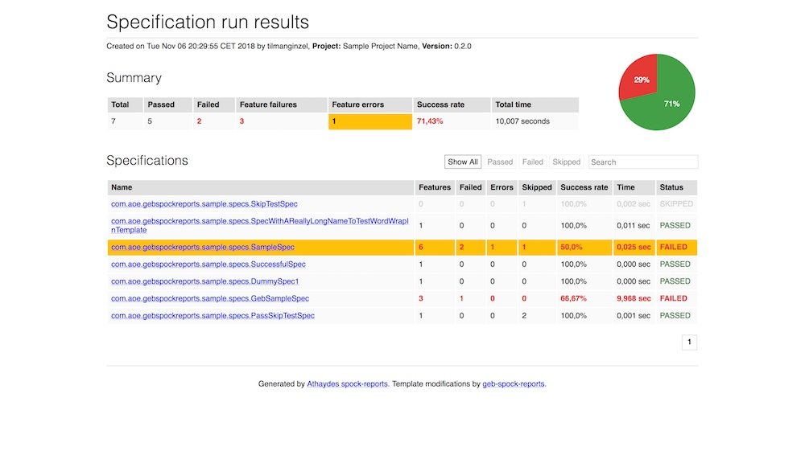
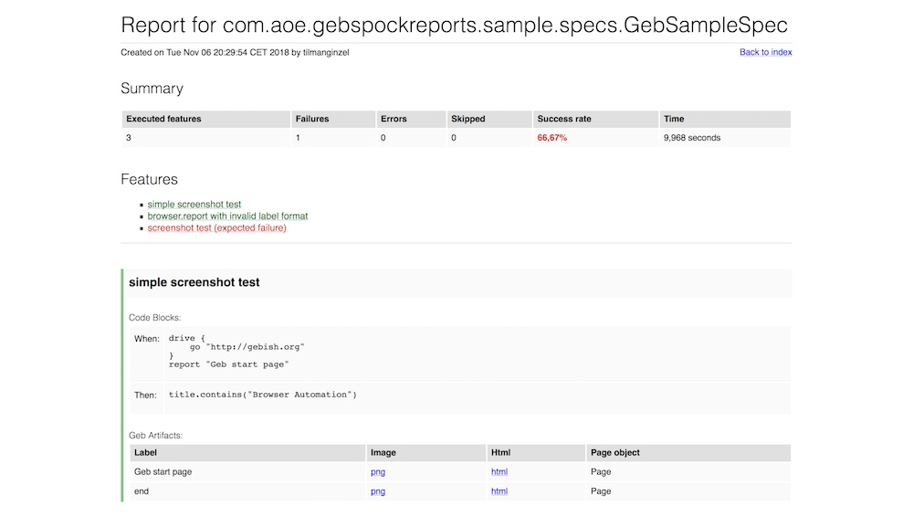

# geb-spock-reports

 [  ](https://bintray.com/aoepeople/libraries/geb-spock-reports/_latestVersion)

geb-spock-reports is a library to integrate [Geb](http://gebish.org/) screenshots into [spock-reports](https://github.com/renatoathaydes/spock-reports).

Report Summary            |  Specification Results
:-------------------------:|:-------------------------:
[](./sample/screenshots/geb-spock-reports_summary-template.png) | [](./sample/screenshots/geb-spock-reports_spec-template-thumb.jpg)

* [Compatibility](#compatibility)
* [Usage](#usage)
* [Configuration](#configuration)
  * [Configure Geb](#configure-geb)
  * [Configure spock-reports](#configure-spock-reports)
  * [Configure geb-spock-reports](#configure-geb-spock-reports)
* [Override CSS](#override-css)
* [Caveats](#caveats)
* [License](#license)

## Compatibility

| geb-spock-reports | spock-reports | spock-core  | Groovy   | JUnit |
|-------------------|---------------|-------------|----------|-------|
| 0.3.0-RC1         | 2.0-RC2       | 2.0-M2      | 3.0.*    | 5     |
| 0.2.6             | 1.6.0         | 1.1         | 2.4.*    | 4     |

## Usage

Add `mavenCentral()` to the repositories in your `build.gradle`.

```groovy
repositories {
    mavenCentral()
}
``` 

Add dependencies.

```groovy
dependencies {
    testImplementation 'com.aoe:geb-spock-reports:0.3.0-RC1'

    // required spock libraries
    testImplementation "org.spockframework:spock-core:2.0-M2-groovy-3.0"
    testImplementation "org.spockframework:spock-junit4:2.0-M2-groovy-3.0"
    testImplementation ("com.athaydes:spock-reports:2.0-RC2") { transitive = false }
    
    // required geb libraries
    testImplementation "org.gebish:geb-spock:3.4"
    
    // you may also need selenium support
    testImplementation "org.seleniumhq.selenium:selenium-firefox-driver:3.11.0"
    testImplementation "org.seleniumhq.selenium:selenium-support:3.11.0"
    
    // recommended for logging
    testImplementation 'org.slf4j:slf4j-api:1.7.30'
    testImplementation 'org.slf4j:slf4j-simple:1.7.30'
}
```

Reported screenshots can only be embedded in the html report if they follow a specific naming convention.
To do this, simply extend [`GebReportingSpec`](https://gebish.org/manual/current/#testing-reporting) instead of `GebSpec` in your tests.

## Configuration

### Configure Geb

Create a `GebConfig.groovy` in `src/test/resources`.
See [Book of Geb](http://gebish.org/manual/current/#configuration) for further configuration.

```groovy
import com.aoe.gebspockreports.GebReportingListener

reportingListener = new GebReportingListener()
reportsDir = 'build/geb-spock-reports'
```

### Configure spock-reports

Create a properties file named 

`src/test/resources/META-INF/services/com.athaydes.spockframework.report.IReportCreator.properties`


The following properties are required.

```properties
# output directory relative to working directory
com.athaydes.spockframework.report.outputDir=build/geb-spock-reports

# let's use the TemplateReportCreator to utilize our custom template
com.athaydes.spockframework.report.IReportCreator=com.athaydes.spockframework.report.template.TemplateReportCreator

# if true, code blocks are shown
com.athaydes.spockframework.report.showCodeBlocks=true

# specific properties to the TemplateReportCreator
com.athaydes.spockframework.report.template.TemplateReportCreator.specTemplateFile=/templates/spec-template.html
com.athaydes.spockframework.report.template.TemplateReportCreator.reportFileExtension=html
com.athaydes.spockframework.report.template.TemplateReportCreator.summaryTemplateFile=/templates/summary-template.html
com.athaydes.spockframework.report.template.TemplateReportCreator.summaryFileName=index.html

# Set the name of the project under test so it can be displayed in the report or leave empty and it will be ignored
com.athaydes.spockframework.report.projectName=Sample Project Name

# Set the version of the project under test so it can be displayed in the report or leave empty and it will be ignored
com.athaydes.spockframework.report.projectVersion=0.3.0-RC1
```

See the [spock-reports documentation](https://github.com/renatoathaydes/spock-reports#customizing-the-reports) for further configuration.

---

**Important:** Make sure that the `reportDir` in `GebConfig.groovy` matches the `outputDir` in the `.properties` file!

### Configure geb-spock-reports

You can configure if pagination should be enabled the summary page.
If pagination is disabled, *all* specifications results will be shown in the table.
By default, pagination is disabled and this config file is not needed.
To overwrite it, create a `GebSpockReportsConfig.groovy` file in `src/test/resources/` with the following content:

```groovy
// configure pagination on summary template
pagination {
    enabled = true
    pageSize = 20
}

// path must be relative to classpath (e.g. inside /src/test/resources/)
customCssFile = "custom.css"
```

## Override CSS

You can customize the CSS to your needs via two different options:

1. Create a `custom.css` file in your test resources and configure it as described above.
This method is especially useful if you want to make only minor style changes.
2. Alternatively, you can copy [`base.css`](https://github.com/AOEpeople/geb-spock-reports/blob/master/src/main/resources/templates/base.css), [`spec.css`](https://github.com/AOEpeople/geb-spock-reports/blob/master/src/main/resources/templates/spec.css) and [`summary.css`](https://github.com/AOEpeople/geb-spock-reports/blob/master/src/main/resources/templates/summary.css) to `src/test/resources/templates` in your project and adapt to your needs.

## Caveats

* If you use Spock's data tables via the `where:` clause, make sure to also use the `@Unroll` annotation.
  Otherwise it is not possible to map the Geb artifacts (screenshots / DOM snapshot) to the correct feature (#18).
* If you re-run tests, you should clean the tests results in between `./gradlew clean`.

## License

This project is licensed under the [Apache Software License, Version 2.0](http://www.apache.org/licenses/LICENSE-2.0).

See [`LICENSE`](LICENSE) for more information.

    Copyright 2017-2020 Tilman Ginzel, AOE GmbH

    Licensed under the Apache License, Version 2.0 (the "License");
    you may not use this file except in compliance with the License.
    You may obtain a copy of the License at

        http://www.apache.org/licenses/LICENSE-2.0

    Unless required by applicable law or agreed to in writing, software
    distributed under the License is distributed on an "AS IS" BASIS,
    WITHOUT WARRANTIES OR CONDITIONS OF ANY KIND, either express or implied.
    See the License for the specific language governing permissions and
    limitations under the License.